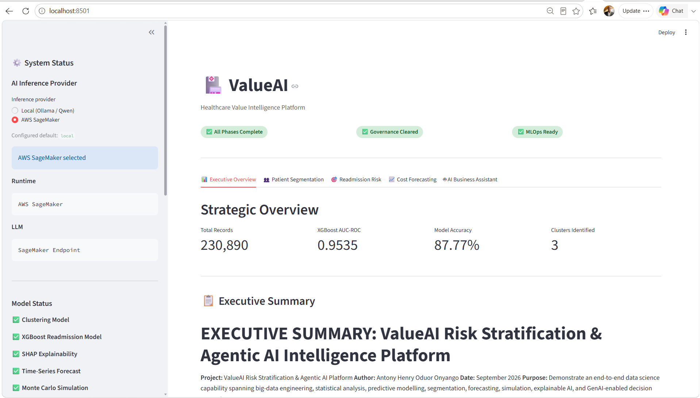
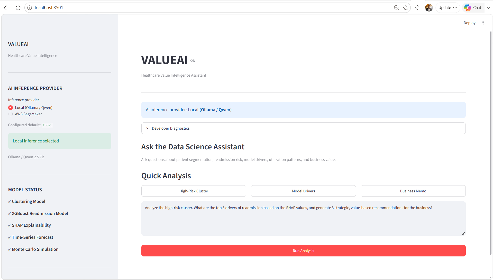
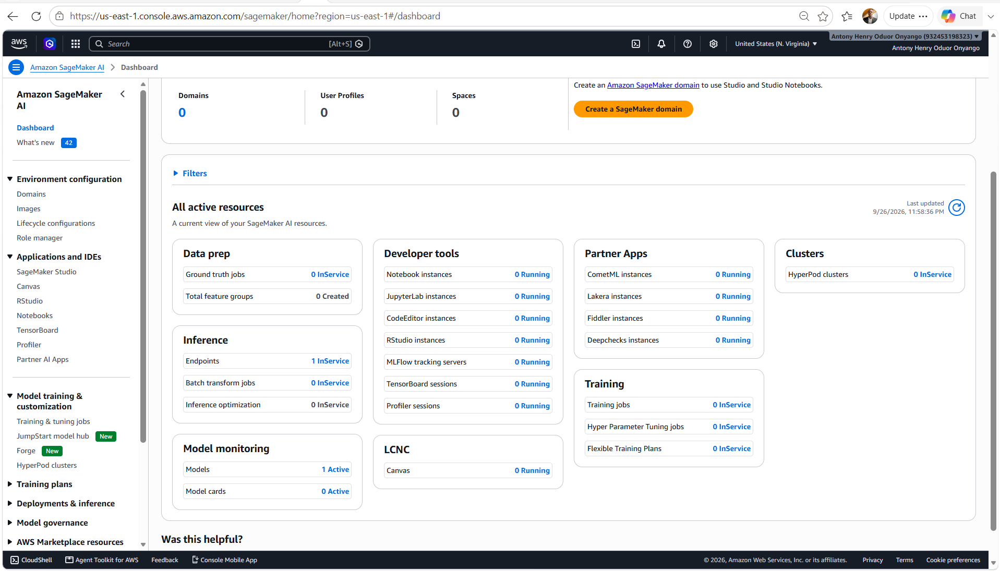
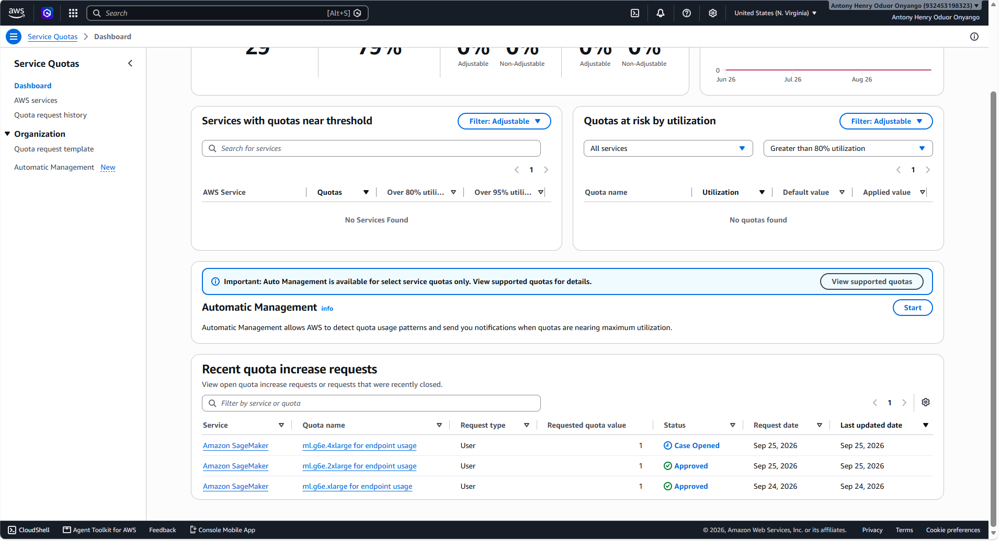

# ValueAI: End-to-End Risk Stratification & Agentic AI Insights

## Project Overview
This project builds a scalable cloud pipeline that segments users, predicts future outcomes, and deploys an Agentic AI assistant for value-based programs. 

## Directory Structure
- `data/`: Raw and processed datasets.
- `notebooks/`: Exploratory data analysis.
- `src/`: Production-ready modular Python code.
- `app/`: Streamlit dashboard.
- `docs/`: Executive summary and audit logs.

## Setup
1. `python -m venv venv`
2. `venv\Scripts\activate`
3. `pip install -r requirements.txt`
4. `streamlit run app/app.py`


## 📊 Dashboard Screenshots

### Executive Dashboard


### Intelligence Platform Developer Dashboard


### Sagemaker Deployments


### Sagemaker Quotas


##  Video Presentation
[Watch the 35-minute project presentation](presentation/project_presentation.mp4)


## Remove all contents created by download_synpuf_data.ps1 off the synpuf directory safely
Remove-Item -Path ".\data\raw\synpuf\*" -Recurse -Force -ErrorAction SilentlyContinue
Write-Host "[OK] Downloaded data cleared successfully." -ForegroundColor Green

# Run download_synpuf_data.ps1 to download the data
.\scripts\download_synpuf_data.ps1


# 1. Download the data
cd scripts
.\download_synpuf_data.ps1
cd ..

### ✅ Pre-Flight Check (Do this first)
Just to be 100% sure all dependencies are ready (especially since we added `great-expectations` and `matplotlib`), run this quick command in your active `.venv`:
```powershell
pip install -r requirements.txt
```

---

### 🚀 Execute the Phase 1 Pipeline

Run these three commands in order. I have included what you should expect to see so you know it's working correctly.


(
### 🛠️ Step 1: Install Java (JDK 11) via Windows Package Manager
We will use `winget` (built into modern Windows) to install Eclipse Temurin (a reliable, open-source JDK). 

1. Open a **new** PowerShell window (you can use your current one).
2. Copy and paste this command and press **Enter**:
   ```powershell
   winget install --id EclipseAdoptium.Temurin.11.JDK -e
   ```
   *(If it asks for administrator permission or terms of agreement, type `Y` and press Enter).*

---

### 🛠️ Step 2: Set the `JAVA_HOME` Environment Variable
Once the installation finishes, we need to tell Windows where Java lives. 

1. **Close your current PowerShell terminal** and open a **new** one (this is required to pick up the new installation).
2. Run this PowerShell script to automatically find the installation and set `JAVA_HOME`:
   ```powershell
   # Find the newly installed JDK 11 directory
   $javaDir = Get-ChildItem "C:\Program Files\Eclipse Adoptium" -Filter "jdk-11*" -ErrorAction SilentlyContinue | Select-Object -First 1

   if ($javaDir) {
       # Set JAVA_HOME for the current user permanently
       [Environment]::SetEnvironmentVariable("JAVA_HOME", $javaDir.FullName, "User")
       
       # Set it for the current session immediately
       $env:JAVA_HOME = $javaDir.FullName
       
       # Add Java to PATH for this session
       $env:Path = "$env:JAVA_HOME\bin;" + $env:Path
       
       Write-Host "✅ JAVA_HOME successfully set to: $($javaDir.FullName)" -ForegroundColor Green
       Write-Host "✅ Java version:" -ForegroundColor Green
       java -version
   } else {
       Write-Host "⚠️ Could not find Java automatically." -ForegroundColor Yellow
       Write-Host "Please install manually from: https://adoptium.net/temurin/releases/?version=11" -ForegroundColor Yellow
   }
   ```

---

### 🛠️ Step 3: Verify and Run the Pipeline Again
1. Verify Java is working by running:
   ```powershell
   java -version
   ```
   *(You should see output like `openjdk version "11.0.x"`)*

2. Now, run your PySpark pipeline again:
   ```powershell
   python -m src.data.make_dataset
   ```
)


#### 1. Run the Main PySpark Pipeline
```powershell
python -m src.data.make_dataset
```
**What to expect:** 
- You will see Spark initialization logs.
- It will load the 2008/2009 beneficiary files and union them.
- It will load the claims files, build the 30-day readmission target, and engineer the rolling average features.
- It will perform the stratified split and save `.parquet` files.
- **Success Indicator:** You should see `✅ Pipeline completed in XX.X seconds` and `📁 Processed data saved to...`


#### 2. Validate Data Quality
```powershell
python -m src.data.validate_data
```
**What to expect:**
- Great Expectations will read your new `train.parquet` file.
- It will run the 6 business rules (no null IDs, age bounds, boolean targets, etc.).
- **Success Indicator:** You should see `📋 Data quality report saved to: ...` followed by `Validation PASSED ✅`. *(Note: Great Expectations updates its API frequently. If you get a minor syntax error here, just paste it to me and I will give you the 1-line fix).*

#### 3. Run Monte Carlo Simulation
```powershell
python -m src.data.monte_carlo_simulation
```
**What to expect:**
- It will read the `AVG_ADMISSION_COST` from your processed data.
- It will fit a log-normal distribution and run 10,000 simulations.
- **Success Indicator:** You should see `✅ Monte Carlo simulation complete`, the projected total cost, and a new file named `monte_carlo_projection.png` will appear in your `data/processed/` folder.

---

### 🔍 How to Verify Success
After running all three, type this in your terminal:
```powershell
Get-ChildItem -Path .\data\processed\ -Recurse
```
You should see:
- `train.parquet`, `val.parquet`, `test.parquet`, `full_dataset.parquet`
- `data_profile_summary.csv`
- `monte_carlo_results.json`
- `monte_carlo_projection.png`

And in your `docs/` folder:
- `data_quality_report.md`

---

### 🛑 If You Hit a Snag
If any of these commands throw an error (e.g., a PySpark Java path issue, or a Great Expectations version mismatch), **don't panic**. This is normal in data engineering. Just copy the **last 10-15 lines of the error traceback** and paste it here. I will give you the exact fix.

Otherwise, paste the success output here, and we will immediately move to **Phase 2: Econometric, Statistical & ML Modeling** (Clustering, XGBoost, and Time-Series)!


# #####################################################################################################################################################


# ValueAI — Healthcare Value Intelligence Platform

> An end-to-end healthcare analytics and AI platform that transforms claims data into patient segmentation, readmission-risk intelligence, cost forecasting, scenario analysis, and evidence-grounded executive recommendations.

---

## Overview

**ValueAI** is an end-to-end healthcare value intelligence platform built to demonstrate how modern data engineering, machine learning, explainable AI, forecasting, MLOps, and generative AI can be combined into a single business-facing solution.

The platform processes **230,890 healthcare beneficiary records** derived from the CMS DE-SynPUF dataset and produces analytical intelligence across:

* Patient risk segmentation
* Readmission prediction
* Explainable machine learning
* Healthcare cost forecasting
* Monte Carlo scenario analysis
* MLOps and model tracking
* Evidence-first agentic AI
* Executive business intelligence

The final application is delivered through a **Streamlit executive dashboard**, allowing stakeholders to explore analytical results and interact with a local **Qwen 2.5 7B + LangGraph** data science assistant using natural-language business questions.

---

# Business Problem

Healthcare organizations generate large volumes of claims and utilization data, but raw claims data does not directly answer executive questions such as:

* Which patient populations require the greatest attention?
* Which characteristics are associated with higher readmission risk?
* What factors are most important to the predictive model?
* How does utilization differ between patient segments?
* What might future healthcare costs look like?
* Where could targeted interventions potentially create value?
* Can decision-makers query analytical evidence using natural language?

ValueAI addresses these questions by connecting the analytical lifecycle from **raw data to executive decision support**.

---

# Solution Architecture

```text
                         VALUEAI
              Healthcare Value Intelligence
                              │
                              ▼
                    ┌───────────────────┐
                    │   CMS DE-SynPUF   │
                    │   Claims Data     │
                    └─────────┬─────────┘
                              │
                              ▼
                    Data Engineering Layer
                              │
                    ┌─────────┴─────────┐
                    │                   │
              Feature Engineering   Data Validation
                    │                   │
                    └─────────┬─────────┘
                              │
                              ▼
                     Analytical Dataset
                       230,890 records
                              │
          ┌───────────────────┼────────────────────┐
          │                   │                    │
          ▼                   ▼                    ▼
     GMM Clustering      XGBoost Model        ARIMA Forecast
          │                   │                    │
          ▼                   ▼                    ▼
   Patient Segments       Readmission          Cost Projection
                          Prediction
                              │
                              ▼
                       SHAP Explainability
                              │
                              ▼
                    Monte Carlo Simulation
                              │
                              ▼
                         MLflow / MLOps
                              │
                              ▼
                    Evidence-First AI Layer
                              │
                    ┌─────────┴─────────┐
                    │                   │
                 LangGraph           Qwen 2.5
                    │                  7B
                    └─────────┬─────────┘
                              │
                              ▼
                   Executive Streamlit
                        Dashboard
                              │
          ┌───────────────────┼────────────────────┐
          │                   │                    │
          ▼                   ▼                    ▼
     Segmentation       Readmission          Forecasting
     Intelligence        Intelligence        Intelligence
                              │
                              ▼
                    Business Recommendations
```

---

# Key Capabilities

## 1. Patient Risk Segmentation

A **Gaussian Mixture Model (GMM)** is used to segment beneficiaries according to healthcare utilization and risk characteristics.

The resulting clusters provide a population-level view of differences in:

* Age
* Inpatient utilization
* Outpatient utilization
* Admission frequency
* Diagnosis burden
* Healthcare costs

The platform identifies a high-risk segment and makes its characteristics available to downstream analytical and AI components.

---

## 2. Readmission Risk Prediction

An **XGBoost classification model** predicts readmission risk using engineered healthcare utilization and beneficiary features.

The model is evaluated using metrics including:

* AUC-ROC
* Accuracy
* Training/test sample counts

Model artifacts and metadata are persisted under:

```text
models/
├── classification_model.pkl
└── classification_metadata.json
```

The final dashboard exposes the model's evaluation results to stakeholders.

---

## 3. Explainable AI with SHAP

Model predictions are supported by **SHAP (SHapley Additive exPlanations)** analysis.

The platform calculates feature importance using mean absolute SHAP values and exposes the results through:

```text
docs/
├── shap_feature_importance.csv
└── shap_summary.png
```

This allows stakeholders to understand which features have the greatest influence on model predictions.

### Important analytical distinction

Mean absolute SHAP importance represents the **magnitude of a feature's contribution to model predictions**.

It does not by itself:

* establish causation;
* indicate whether higher or lower values increase risk;
* prove that changing a feature will change patient outcomes.

This distinction is explicitly communicated within the dashboard and AI assistant.

---

# 4. Healthcare Cost Forecasting

ValueAI includes a time-series forecasting pipeline using **ARIMA** to project healthcare costs.

Forecast artifacts include:

```text
docs/
├── timeseries_forecast.csv
├── timeseries_forecast.png
├── timeseries_holdout_evaluation.csv
├── timeseries_model_metrics.csv
└── timeseries_model_metadata.json
```

The dashboard presents:

* Forecasted costs
* Average projected monthly cost
* Forecast horizon
* Model evaluation metrics
* Comparison against a baseline

This provides a forward-looking component alongside the historical and predictive analytics.

---

# 5. Monte Carlo Scenario Analysis

The platform also performs Monte Carlo simulation to model uncertainty around healthcare admission costs.

Outputs include:

```text
data/processed/
├── monte_carlo_results.json
└── monte_carlo_projection.png
```

This extends the platform beyond point estimates by allowing uncertainty and potential cost distributions to be examined.

---

# 6. Evidence-First Agentic AI

The platform includes an AI assistant built with:

* **LangGraph**
* **Qwen 2.5 7B**
* Deterministic analytical tools
* Evidence retrieval from Phase 2 artifacts

The architecture is intentionally **evidence-first**.

Instead of allowing the language model to independently invent analytical conclusions, the system routes relevant questions toward specialized analytical evidence before generating the final response.

Example question:

```text
Analyze the high-risk cluster.

What are the top 3 drivers of readmission based on
the SHAP values, and generate 3 strategic,
value-based recommendations for the business?
```

The assistant can return:

* Executive summary
* High-risk population characteristics
* SHAP model drivers
* Observed data findings
* Strategic intervention hypotheses
* Value mechanisms
* Suggested KPIs
* Model/data caveats

This creates a bridge between **technical analytics and executive decision support**.

---

# 7. Executive Dashboard

The final application is implemented using **Streamlit**.

The main dashboard contains five sections:

### Executive Overview

Provides high-level business metrics and findings.

### Patient Segmentation

Provides:

* Cluster distribution
* Cluster characteristics
* SHAP visualization
* Risk-segment analysis

### Readmission Risk

Provides:

* XGBoost model performance
* Training/test information
* SHAP feature importance
* Model interpretation guidance

### Cost Forecasting

Provides:

* ARIMA forecast visualization
* Model evaluation
* Forecast metrics
* Projected cost information

### AI Business Assistant

Provides a natural-language interface to the evidence-first AI agent.

---

# Example Analytical Insight

The current analytical artifacts identify **Cluster 2** as the high-risk segment.

The available analysis reports:

* **30,298 patients**
* **13.12%** of the 230,890-record population
* Average age of approximately **75 years**
* Approximately **2.91 inpatient admissions per patient**
* Average inpatient length of stay of approximately **5.62 days**
* Average inpatient cost of approximately **$9,484**
* Average diagnosis count of approximately **22.09**

The three highest mean absolute SHAP features currently reported for readmission prediction are:

1. `AVG_DAYS_BETWEEN_INPATIENT_CLAIMS`
2. `TOTAL_ADMISSIONS`
3. `BENRES_IP`

These findings are presented as **model evidence rather than causal conclusions**.

---

# Technology Stack

| Area             | Technology                 |
| ---------------- | -------------------------- |
| Language         | Python                     |
| Data Processing  | PySpark, Pandas, NumPy     |
| Data Format      | Parquet, CSV, JSON         |
| Machine Learning | Scikit-learn, XGBoost      |
| Clustering       | Gaussian Mixture Model     |
| Explainability   | SHAP                       |
| Time Series      | Statsmodels / ARIMA        |
| Simulation       | Monte Carlo                |
| Generative AI    | Qwen 2.5 7B                |
| Agent Framework  | LangGraph                  |
| LLM Integration  | LangChain / Ollama         |
| MLOps            | MLflow                     |
| Dashboard        | Streamlit                  |
| Testing          | Pytest                     |
| CI/CD            | GitHub Actions             |
| Environment      | Python virtual environment |

---

# Project Structure

```text
ValueAI_Project/
│
├── app/
│   ├── app.py
│   └── components/
│
├── data/
│   ├── external/
│   ├── processed/
│   │   ├── clustered_dataset.parquet
│   │   ├── full_dataset.parquet
│   │   ├── train.parquet
│   │   ├── val.parquet
│   │   ├── test.parquet
│   │   ├── monte_carlo_results.json
│   │   └── monte_carlo_projection.png
│   │
│   └── raw/
│       └── synpuf/
│
├── docs/
│   ├── cluster_distribution.png
│   ├── compliance_and_audit.md
│   ├── data_dictionary.md
│   ├── data_governance_audit.md
│   ├── executive_summary.md
│   ├── shap_feature_importance.csv
│   ├── shap_summary.png
│   ├── timeseries_forecast.csv
│   ├── timeseries_forecast.png
│   ├── timeseries_holdout_evaluation.csv
│   ├── timeseries_model_metadata.json
│   └── timeseries_model_metrics.csv
│
├── models/
│   ├── classification_metadata.json
│   ├── classification_model.pkl
│   ├── clustering_model.pkl
│   ├── clustering_scaler.pkl
│   └── timeseries_model.pkl
│
├── notebooks/
│   ├── 01_data_exploration.ipynb
│   ├── 02_feature_engineering.ipynb
│   └── 03_modeling_experiments.ipynb
│
├── src/
│   ├── ai_agent/
│   │   ├── agent_graph.py
│   │   ├── agent_tools.py
│   │   └── streamlit_app.py
│   │
│   ├── data/
│   │   ├── make_dataset.py
│   │   ├── monte_carlo_simulation.py
│   │   └── validate_data.py
│   │
│   ├── mlops/
│   │   └── log_models.py
│   │
│   ├── models/
│   │   ├── train_classification.py
│   │   ├── train_clustering.py
│   │   └── train_timeseries.py
│   │
│   └── utils/
│       ├── config.py
│       └── logger.py
│
├── tests/
│   ├── test_agent.py
│   └── test_data.py
│
├── .github/
│   └── workflows/
│       └── ci.yml
│
├── requirements.txt
├── README.md
└── Codebase.md
```

---

# Installation

## 1. Clone the repository

```bash
git clone <repository-url>
cd ValueAI_Project
```

## 2. Create a virtual environment

Windows PowerShell:

```powershell
python -m venv .venv
.\.venv\Scripts\Activate.ps1
```

## 3. Install dependencies

```powershell
python -m pip install --upgrade pip
pip install -r requirements.txt
```

---

# Running the Platform

## Start the Streamlit dashboard

From the project root:

```powershell
streamlit run app/app.py
```

The dashboard will be available locally through Streamlit.

---

# Running the AI Assistant

The AI assistant uses a locally hosted Qwen model through Ollama.

Ensure Ollama is installed and the required model is available:

```powershell
ollama run qwen2.5:7b
```

Then start the dashboard:

```powershell
streamlit run app/app.py
```

Navigate to:

```text
🤖 AI Business Assistant
```

Example questions:

```text
Analyze the high-risk cluster and give 3 strategic recommendations.
```

```text
What are the top drivers of readmission?
```

```text
Generate an executive memo for the high-risk segment.
```

---

# Reproducing the Analytical Pipeline

The major pipeline stages can be executed independently.

## Data preparation

```powershell
python -m src.data.make_dataset
```

## Data validation

```powershell
python -m src.data.validate_data
```

## Patient clustering

```powershell
python -m src.models.train_clustering
```

## Readmission classification

```powershell
python -m src.models.train_classification
```

## Time-series forecasting

```powershell
python -m src.models.train_timeseries
```

## Monte Carlo simulation

```powershell
python -m src.data.monte_carlo_simulation
```

## MLflow model logging

```powershell
python -m src.mlops.log_models
```

---

# MLOps

ValueAI incorporates MLflow for experiment and model lifecycle tracking.

Tracked artifacts include:

* Classification models
* Clustering models
* Time-series models
* Model metadata
* Evaluation metrics
* Forecast artifacts
* SHAP artifacts

The project contains a local MLflow tracking database and model artifacts under:

```text
mlflow.db
mlruns/
```

This provides a foundation for reproducible model experimentation and model lifecycle management.

---

# Data Governance & Responsible AI

Because the project operates on healthcare-related data, governance and responsible analytical interpretation are treated as first-class concerns.

The repository includes:

```text
docs/
├── compliance_and_audit.md
├── data_governance_audit.md
└── data_dictionary.md
```

The system explicitly distinguishes between:

### Descriptive analysis

What the observed data shows.

### Predictive modeling

What the model predicts.

### Explainability

Which features contribute most strongly to model predictions.

### Causal inference

What actually causes an outcome.

The platform does **not** treat predictive associations or SHAP importance as proof of causation.

The AI assistant also communicates model limitations and avoids presenting model outputs as clinical diagnoses.

---

# Testing

Tests are maintained under:

```text
tests/
├── test_agent.py
└── test_data.py
```

The project also includes a GitHub Actions workflow:

```text
.github/workflows/ci.yml
```

The purpose of the test and CI layer is to provide automated validation of important data and application functionality.

---

# Key Engineering Principles

## Evidence First

The AI assistant should ground business responses in available analytical artifacts rather than relying solely on language-model generation.

## Separation of Concerns

The project separates:

```text
Data
  ↓
Models
  ↓
Explainability
  ↓
MLOps
  ↓
AI Agent
  ↓
Presentation
```

## Reproducibility

Analytical outputs are persisted as explicit artifacts rather than being generated exclusively inside the dashboard.

## Explainability

Predictive results are accompanied by interpretable feature-importance analysis.

## Responsible AI

Model outputs are presented with appropriate limitations and are not represented as causal or clinical conclusions.

## Business Translation

The final layer translates technical analytical findings into business-oriented insights, intervention hypotheses, and KPIs.

---

# Limitations

ValueAI is a portfolio and analytical demonstration platform rather than a production clinical decision-support system.

Important limitations include:

* The dataset is based on CMS DE-SynPUF rather than live healthcare operations.
* Predictive associations should not be interpreted as causal relationships.
* SHAP importance does not establish causation.
* Mean absolute SHAP values do not provide feature direction.
* Forecasts are subject to historical-data limitations and model assumptions.
* Monte Carlo outputs depend on the assumptions and distributions used by the simulation.
* AI-generated recommendations are business hypotheses requiring domain validation.
* The platform should not be used as a clinical diagnostic system.

---

# Project Outcomes

ValueAI demonstrates the ability to build a complete analytical product rather than an isolated machine-learning model.

The project combines:

```text
Data Engineering
       +
Statistical Analysis
       +
Machine Learning
       +
Explainable AI
       +
Forecasting
       +
Simulation
       +
MLOps
       +
Generative AI
       +
Agentic AI
       +
Business Intelligence
       +
Governance
```

The result is a unified platform capable of moving from **raw healthcare data to stakeholder-facing intelligence**.

---

# Portfolio Highlights

This project demonstrates practical experience across the following areas:

* Python data engineering
* PySpark
* Large-scale claims-data processing
* Feature engineering
* Unsupervised learning
* Supervised machine learning
* XGBoost
* Gaussian Mixture Models
* SHAP explainability
* Time-series forecasting
* Monte Carlo simulation
* MLflow
* LangGraph
* LangChain
* Local LLM deployment
* Qwen 2.5
* Evidence-grounded AI
* Streamlit application development
* Automated testing
* CI/CD
* Data governance
* Executive analytics

---

# Author

**Antony Henry Oduor Onyanko**

Computer Science | Data & AI | Analytics Engineering

Nairobi, Kenya

---

## Project Status

**Status: Portfolio-ready end-to-end prototype**

The platform currently includes the major data, analytics, machine-learning, MLOps, generative-AI, governance, and stakeholder-facing application layers required for the ValueAI project.

Future production-oriented enhancements could include:

* Cloud deployment
* Production database integration
* Authentication and role-based access control
* Model monitoring
* Data drift detection
* Automated model retraining
* API-based model serving
* Production observability
* Additional clinical/business validation


# Deployment complete evidence 


(.venv) PS C:\Data\ValueAI_Project> python scripts/deploy_sagemaker.py `
>>   --role-arn "arn:aws:iam::932453198323:role/ValueAI-SageMaker-ExecutionRole" `
>>   --endpoint-name "valueai-qwen25-7b" `
>>   --instance-type "ml.g6e.xlarge" `
>>   --fallback-instance-types "ml.g6e.2xlarge" `
>>   --config-name "generate_lowest_cost" `
>>   --model-version "1.42.0" `
>>   --provision-timeout 1800
========================================================================
VALUEAI — PHASE 15 SAGEMAKER DEPLOYMENT
INSTANCE-POOL CAPACITY FALLBACK ENABLED
========================================================================

[CONFIG]
Region:              us-east-1
Model ID:             huggingface-llm-qwen2-5-7b-instruct
Model version:        1.42.0
Endpoint:             valueai-qwen25-7b
Primary instance:     ml.g6e.xlarge
Config:               generate_lowest_cost
Provision timeout:    1800s
Role ARN:             arn:aws:iam::932453198323:role/ValueAI-SageMaker-ExecutionRole

[INSTANCE POOLS]
SageMaker will attempt instance types in this order:
  Priority 1: ml.g6e.xlarge      [PRIMARY]
  Priority 2: ml.g6e.2xlarge     [FALLBACK 1]

[AWS CREDENTIALS]
Account:        932453198323
Caller ARN:     arn:aws:iam::932453198323:user/ValueAI-Project-User

[IAM ROLE]
Role name:      ValueAI-SageMaker-ExecutionRole
Role ARN:       arn:aws:iam::932453198323:role/ValueAI-SageMaker-ExecutionRole

[JUMPSTART MODEL]
Default instance: ml.g6e.2xlarge
Supported default instances: ml.g4dn.12xlarge, ml.g5.12xlarge, ml.g6.12xlarge, ml.g6e.2xlarge, ml.g6e.4xlarge, ml.g6e.xlarge

[ENDPOINT]
Endpoint does not currently exist.

[VALIDATION]
Validating the requested JumpStart deployment configuration...
[09/26/26 21:58:56] INFO     Found credentials in shared credentials file: ~/.aws/credentials                                            credentials.py:1392
sagemaker.config INFO - Not applying SDK defaults from location: C:\ProgramData\sagemaker\sagemaker\config.yaml
sagemaker.config INFO - Not applying SDK defaults from location: C:\Users\DAYLIFF\AppData\Local\sagemaker\sagemaker\config.yaml

Creating temporary ModelBuilder for deployment-configuration validation...
[09/26/26 21:59:01] INFO     Found credentials in shared credentials file: ~/.aws/credentials                                            credentials.py:1392
                    INFO     SageMaker Python SDK will collect telemetry to help us better understand our user's needs, diagnose    telemetry_logging.py:325
                             issues, and deliver additional features.
                             To opt out of telemetry, please disable via TelemetryOptOut parameter in SDK defaults config. For more
                             information, refer to
                             https://sagemaker.readthedocs.io/en/stable/overview.html#configuring-and-using-defaults-with-the-sagem
                             aker-python-sdk.
                    DEBUG    Auto-detecting optimal instance type for model...                                                    model_builder_utils.py:342
Using model 'huggingface-llm-qwen2-5-7b-instruct' with wildcard version identifier '*'. You can pin to version '1.42.0' for more stable results. Note that models may have different input/output signatures after a major version upgrade.
[09/26/26 22:00:37] WARNING  Using model 'huggingface-llm-qwen2-5-7b-instruct' with wildcard version identifier '*'. You can pin to version     cache.py:624
                             '1.42.0' for more stable results. Note that models may have different input/output signatures after a major
                             version upgrade.
                    DEBUG    JumpStart Model ID detected.                                                                        model_builder_utils.py:2922
                    DEBUG    Using default CPU instance type: ml.m5.large                                                         model_builder_utils.py:376
[09/26/26 22:03:07] WARNING  Couldn't call 'get_role' to get Role ARN from role name ValueAI-Project-User to get Role path.            session_helper.py:375
[09/26/26 22:03:14] WARNING  Couldn't call 'get_role' to get Role ARN from role name ValueAI-Project-User to get Role path.            session_helper.py:375
Overriding instance type to ml.g5.xlarge
                    WARNING  Overriding instance type to ml.g5.xlarge                                                                           utils.py:241
[09/26/26 22:03:18] WARNING  Couldn't call 'get_role' to get Role ARN from role name ValueAI-Project-User to get Role path.            session_helper.py:375
Overriding instance type to ml.g6e.24xlarge
                    WARNING  Overriding instance type to ml.g6e.24xlarge                                                                        utils.py:241
[09/26/26 22:03:24] WARNING  Couldn't call 'get_role' to get Role ARN from role name ValueAI-Project-User to get Role path.            session_helper.py:375
[09/26/26 22:03:29] WARNING  Couldn't call 'get_role' to get Role ARN from role name ValueAI-Project-User to get Role path.            session_helper.py:375
Overriding instance type to ml.g6e.16xlarge
                    WARNING  Overriding instance type to ml.g6e.16xlarge                                                                        utils.py:241
[09/26/26 22:03:35] WARNING  Couldn't call 'get_role' to get Role ARN from role name ValueAI-Project-User to get Role path.            session_helper.py:375
Overriding instance type to ml.g5.xlarge
                    WARNING  Overriding instance type to ml.g5.xlarge                                                                           utils.py:241
[09/26/26 22:03:41] WARNING  Couldn't call 'get_role' to get Role ARN from role name ValueAI-Project-User to get Role path.            session_helper.py:375
Overriding instance type to ml.g6e.24xlarge
                    WARNING  Overriding instance type to ml.g6e.24xlarge                                                                        utils.py:241
[09/26/26 22:03:46] WARNING  Couldn't call 'get_role' to get Role ARN from role name ValueAI-Project-User to get Role path.            session_helper.py:375
Overriding instance type to ml.g6.xlarge
                    WARNING  Overriding instance type to ml.g6.xlarge                                                                           utils.py:241
[09/26/26 22:03:54] WARNING  Couldn't call 'get_role' to get Role ARN from role name ValueAI-Project-User to get Role path.            session_helper.py:375
Overriding instance type to ml.g6e.24xlarge
                    WARNING  Overriding instance type to ml.g6e.24xlarge                                                                        utils.py:241
[09/26/26 22:03:57] WARNING  Couldn't call 'get_role' to get Role ARN from role name ValueAI-Project-User to get Role path.            session_helper.py:375
Overriding instance type to ml.g6e.12xlarge
                    WARNING  Overriding instance type to ml.g6e.12xlarge                                                                        utils.py:241
[09/26/26 22:04:02] WARNING  Couldn't call 'get_role' to get Role ARN from role name ValueAI-Project-User to get Role path.            session_helper.py:375
[09/26/26 22:04:12] WARNING  Couldn't call 'get_role' to get Role ARN from role name ValueAI-Project-User to get Role path.            session_helper.py:375
[09/26/26 22:04:20] WARNING  Couldn't call 'get_role' to get Role ARN from role name ValueAI-Project-User to get Role path.            session_helper.py:375
[09/26/26 22:04:26] WARNING  Couldn't call 'get_role' to get Role ARN from role name ValueAI-Project-User to get Role path.            session_helper.py:375
Overriding instance type to ml.g6e.24xlarge
                    WARNING  Overriding instance type to ml.g6e.24xlarge                                                                        utils.py:241
[09/26/26 22:04:30] WARNING  Couldn't call 'get_role' to get Role ARN from role name ValueAI-Project-User to get Role path.            session_helper.py:375
[09/26/26 22:04:36] WARNING  Couldn't call 'get_role' to get Role ARN from role name ValueAI-Project-User to get Role path.            session_helper.py:375
[09/26/26 22:04:42] WARNING  Couldn't call 'get_role' to get Role ARN from role name ValueAI-Project-User to get Role path.            session_helper.py:375
[09/26/26 22:04:48] WARNING  Couldn't call 'get_role' to get Role ARN from role name ValueAI-Project-User to get Role path.            session_helper.py:375
Overriding instance type to ml.g6e.24xlarge
                    WARNING  Overriding instance type to ml.g6e.24xlarge                                                                        utils.py:241
[09/26/26 22:04:51] WARNING  Couldn't call 'get_role' to get Role ARN from role name ValueAI-Project-User to get Role path.            session_helper.py:375
[09/26/26 22:04:57] WARNING  Couldn't call 'get_role' to get Role ARN from role name ValueAI-Project-User to get Role path.            session_helper.py:375
Overriding instance type to ml.g6e.24xlarge
                    WARNING  Overriding instance type to ml.g6e.24xlarge                                                                        utils.py:241
                    WARNING  Instance rate metrics will be omitted. Reason: User:                                                model_builder_utils.py:2783
                             arn:aws:iam::932453198323:user/ValueAI-Project-User is not authorized to perform:
                             pricing:GetProducts because no identity-based policy allows the pricing:GetProducts action
Deployment configuration accepted by SageMaker ModelBuilder.
Resolved instance type: ml.g6e.xlarge

Deployment configuration validation completed.

[DEPLOYMENT]
Starting SageMaker deployment with automatic InstancePool fallback.
SageMaker will try the instance types in priority order.

[JUMPSTART CONFIG]
Model ID:       huggingface-llm-qwen2-5-7b-instruct
Model version:  1.42.0
Config name:    generate_lowest_cost
Primary type:   ml.g6e.xlarge
Execution role: arn:aws:iam::932453198323:role/ValueAI-SageMaker-ExecutionRole

[INSTANCE POOLS]
SageMaker will attempt instance types in this order:
  Priority 1: ml.g6e.xlarge      [PRIMARY]
  Priority 2: ml.g6e.2xlarge     [FALLBACK 1]

Creating SageMaker ModelBuilder...
                    INFO     Found credentials in shared credentials file: ~/.aws/credentials                                            credentials.py:1392
                    DEBUG    Auto-detecting optimal instance type for model...                                                    model_builder_utils.py:342
Using model 'huggingface-llm-qwen2-5-7b-instruct' with wildcard version identifier '*'. You can pin to version '1.42.0' for more stable results. Note that models may have different input/output signatures after a major version upgrade.
[09/26/26 22:05:21] WARNING  Using model 'huggingface-llm-qwen2-5-7b-instruct' with wildcard version identifier '*'. You can pin to version     cache.py:624
                             '1.42.0' for more stable results. Note that models may have different input/output signatures after a major
                             version upgrade.
                    DEBUG    JumpStart Model ID detected.                                                                        model_builder_utils.py:2922
                    DEBUG    Using default CPU instance type: ml.m5.large                                                         model_builder_utils.py:376

[DEPLOYMENT CONFIGURATION]
Selecting the requested published JumpStart deployment configuration...
[09/26/26 22:07:08] WARNING  Couldn't call 'get_role' to get Role ARN from role name ValueAI-Project-User to get Role path.            session_helper.py:375
[09/26/26 22:07:14] WARNING  Couldn't call 'get_role' to get Role ARN from role name ValueAI-Project-User to get Role path.            session_helper.py:375
Overriding instance type to ml.g5.xlarge
                    WARNING  Overriding instance type to ml.g5.xlarge                                                                           utils.py:241
[09/26/26 22:07:18] WARNING  Couldn't call 'get_role' to get Role ARN from role name ValueAI-Project-User to get Role path.            session_helper.py:375
Overriding instance type to ml.g6e.24xlarge
                    WARNING  Overriding instance type to ml.g6e.24xlarge                                                                        utils.py:241
[09/26/26 22:07:22] WARNING  Couldn't call 'get_role' to get Role ARN from role name ValueAI-Project-User to get Role path.            session_helper.py:375
[09/26/26 22:07:26] WARNING  Couldn't call 'get_role' to get Role ARN from role name ValueAI-Project-User to get Role path.            session_helper.py:375
Overriding instance type to ml.g6e.16xlarge
                    WARNING  Overriding instance type to ml.g6e.16xlarge                                                                        utils.py:241
[09/26/26 22:07:37] WARNING  Couldn't call 'get_role' to get Role ARN from role name ValueAI-Project-User to get Role path.            session_helper.py:375
Overriding instance type to ml.g5.xlarge
                    WARNING  Overriding instance type to ml.g5.xlarge                                                                           utils.py:241
[09/26/26 22:07:42] WARNING  Couldn't call 'get_role' to get Role ARN from role name ValueAI-Project-User to get Role path.            session_helper.py:375
Overriding instance type to ml.g6e.24xlarge
                    WARNING  Overriding instance type to ml.g6e.24xlarge                                                                        utils.py:241
[09/26/26 22:07:49] WARNING  Couldn't call 'get_role' to get Role ARN from role name ValueAI-Project-User to get Role path.            session_helper.py:375
Overriding instance type to ml.g6.xlarge
                    WARNING  Overriding instance type to ml.g6.xlarge                                                                           utils.py:241
[09/26/26 22:07:58] WARNING  Couldn't call 'get_role' to get Role ARN from role name ValueAI-Project-User to get Role path.            session_helper.py:375
Overriding instance type to ml.g6e.24xlarge
                    WARNING  Overriding instance type to ml.g6e.24xlarge                                                                        utils.py:241
[09/26/26 22:08:07] WARNING  Couldn't call 'get_role' to get Role ARN from role name ValueAI-Project-User to get Role path.            session_helper.py:375
Overriding instance type to ml.g6e.12xlarge
                    WARNING  Overriding instance type to ml.g6e.12xlarge                                                                        utils.py:241
[09/26/26 22:08:19] WARNING  Couldn't call 'get_role' to get Role ARN from role name ValueAI-Project-User to get Role path.            session_helper.py:375
[09/26/26 22:08:23] WARNING  Couldn't call 'get_role' to get Role ARN from role name ValueAI-Project-User to get Role path.            session_helper.py:375
[09/26/26 22:08:28] WARNING  Couldn't call 'get_role' to get Role ARN from role name ValueAI-Project-User to get Role path.            session_helper.py:375
[09/26/26 22:08:36] WARNING  Couldn't call 'get_role' to get Role ARN from role name ValueAI-Project-User to get Role path.            session_helper.py:375
Overriding instance type to ml.g6e.24xlarge
                    WARNING  Overriding instance type to ml.g6e.24xlarge                                                                        utils.py:241
[09/26/26 22:08:42] WARNING  Couldn't call 'get_role' to get Role ARN from role name ValueAI-Project-User to get Role path.            session_helper.py:375
[09/26/26 22:08:47] WARNING  Couldn't call 'get_role' to get Role ARN from role name ValueAI-Project-User to get Role path.            session_helper.py:375
[09/26/26 22:08:51] WARNING  Couldn't call 'get_role' to get Role ARN from role name ValueAI-Project-User to get Role path.            session_helper.py:375
[09/26/26 22:08:56] WARNING  Couldn't call 'get_role' to get Role ARN from role name ValueAI-Project-User to get Role path.            session_helper.py:375
Overriding instance type to ml.g6e.24xlarge
                    WARNING  Overriding instance type to ml.g6e.24xlarge                                                                        utils.py:241
[09/26/26 22:09:02] WARNING  Couldn't call 'get_role' to get Role ARN from role name ValueAI-Project-User to get Role path.            session_helper.py:375
[09/26/26 22:09:08] WARNING  Couldn't call 'get_role' to get Role ARN from role name ValueAI-Project-User to get Role path.            session_helper.py:375
Overriding instance type to ml.g6e.24xlarge
                    WARNING  Overriding instance type to ml.g6e.24xlarge                                                                        utils.py:241
                    WARNING  Instance rate metrics will be omitted. Reason: User:                                                model_builder_utils.py:2783
                             arn:aws:iam::932453198323:user/ValueAI-Project-User is not authorized to perform:
                             pricing:GetProducts because no identity-based policy allows the pricing:GetProducts action
Deployment configuration selected.

[BUILD]
Building SageMaker model resource...
[09/26/26 22:09:16] INFO     Created S3 bucket: sagemaker-us-east-1-932453198323                                                       session_helper.py:815
[09/26/26 22:09:18] DEBUG    Either inference spec or model is provided. ModelBuilder is not handling MLflow model input         model_builder_utils.py:1381
                    DEBUG    Building for JumpStart model ID...                                                                        model_builder.py:3579
[09/26/26 22:09:21] WARNING  Couldn't call 'get_role' to get Role ARN from role name ValueAI-Project-User to get Role path.            session_helper.py:375
[09/26/26 22:09:24] INFO     Cannot simulate policies for 'arn:aws:iam::932453198323:role/ValueAI-SageMaker-ExecutionRole' (access  iam_role_resolver.py:422
                             denied); permission verdict unknown.
[09/26/26 22:09:25] WARNING  Could not verify permissions for role 'arn:aws:iam::932453198323:role/ValueAI-SageMaker-ExecutionRole' iam_role_resolver.py:657
                             (caller lacks iam:SimulatePrincipalPolicy). Proceeding with it. If the operation later fails with an
                             access-denied error, ensure the role has the required permissions for 'serving' (see
                             IamRoleResolver().get_required_actions('serving')) or create a dedicated role via
                             IamRoleResolver().create_execution_role(role_type='serving').
[09/26/26 22:09:26] INFO     Cannot simulate policies for 'arn:aws:iam::932453198323:role/ValueAI-SageMaker-ExecutionRole' (access  iam_role_resolver.py:422
                             denied); permission verdict unknown.
[09/26/26 22:09:27] WARNING  Could not verify permissions for role 'arn:aws:iam::932453198323:role/ValueAI-SageMaker-ExecutionRole' iam_role_resolver.py:657
                             (caller lacks iam:SimulatePrincipalPolicy). Proceeding with it. If the operation later fails with an
                             access-denied error, ensure the role has the required permissions for 'serving' (see
                             IamRoleResolver().get_required_actions('serving')) or create a dedicated role via
                             IamRoleResolver().create_execution_role(role_type='serving').
                    INFO     Creating model with name: model-75755a83                                                                 session_helper.py:1922
[09/26/26 22:09:30] DEBUG    No boto3 session provided. Creating a new session.                                                                 utils.py:357
                    DEBUG    No config provided. Using default config.                                                                          utils.py:365
                    INFO     Found credentials in shared credentials file: ~/.aws/credentials                                            credentials.py:1392
[09/26/26 22:09:34] INFO     ✅ Model has been created: 'model-75755a83' using server DJL_SERVING in SAGEMAKER_ENDPOINT mode (ARN:     model_builder.py:4489
                             arn:aws:sagemaker:us-east-1:932453198323:model/model-75755a83)
SageMaker model resource built successfully.
Model resource name: model-75755a83

[INSTANCE POOL DEPLOYMENT]

[ENDPOINT CONFIGURATION]
Creating SageMaker EndpointConfig with InstancePools...
EndpointConfig: valueai-qwen25-7b-pool-1790449774
Model:          model-75755a83
Initial count:  1
Provision timeout: 1800 seconds
EndpointConfig created:
arn:aws:sagemaker:us-east-1:932453198323:endpoint-config/valueai-qwen25-7b-pool-1790449774

[ENDPOINT]
Creating endpoint: valueai-qwen25-7b
Endpoint creation requested.

[WAIT]
SageMaker will now attempt the InstancePools in priority order.
This may still take time for model download and container startup after capacity is found.
[WAIT] Status: Creating | elapsed: 0s
[WAIT] Status: Creating | elapsed: 10s
[WAIT] Status: Creating | elapsed: 21s
[WAIT] Status: Creating | elapsed: 31s
[WAIT] Status: Creating | elapsed: 41s
[WAIT] Status: Creating | elapsed: 52s
[WAIT] Status: Creating | elapsed: 62s
[WAIT] Status: Creating | elapsed: 72s
[WAIT] Status: Creating | elapsed: 83s
[WAIT] Status: Creating | elapsed: 93s
[WAIT] Status: Creating | elapsed: 103s
[WAIT] Status: Creating | elapsed: 114s
[WAIT] Status: Creating | elapsed: 124s
[WAIT] Status: Creating | elapsed: 134s
[WAIT] Status: Creating | elapsed: 145s
[WAIT] Status: Creating | elapsed: 156s
[WAIT] Status: Creating | elapsed: 166s
[WAIT] Status: Creating | elapsed: 176s
[WAIT] Status: Creating | elapsed: 186s
[WAIT] Status: Creating | elapsed: 197s
[WAIT] Status: Creating | elapsed: 207s
[WAIT] Status: Creating | elapsed: 217s
[WAIT] Status: Creating | elapsed: 228s
[WAIT] Status: Creating | elapsed: 239s
[WAIT] Status: Creating | elapsed: 249s
[WAIT] Status: Creating | elapsed: 260s
[WAIT] Status: Creating | elapsed: 270s
[WAIT] Status: Creating | elapsed: 280s
[WAIT] Status: Creating | elapsed: 291s
[WAIT] Status: Creating | elapsed: 301s
[WAIT] Status: Creating | elapsed: 311s
[WAIT] Status: Creating | elapsed: 322s
[WAIT] Status: Creating | elapsed: 333s
[WAIT] Status: Creating | elapsed: 343s
[WAIT] Status: Creating | elapsed: 354s
[WAIT] Status: Creating | elapsed: 364s
[WAIT] Status: Creating | elapsed: 374s
[WAIT] Status: Creating | elapsed: 385s
[WAIT] Status: Creating | elapsed: 395s
[WAIT] Status: Creating | elapsed: 405s
[WAIT] Status: Creating | elapsed: 416s
[WAIT] Status: Creating | elapsed: 426s
[WAIT] Status: Creating | elapsed: 436s
[WAIT] Status: Creating | elapsed: 447s
[WAIT] Status: Creating | elapsed: 457s
[WAIT] Status: Creating | elapsed: 467s
[WAIT] Status: Creating | elapsed: 477s
[WAIT] Status: Creating | elapsed: 489s
[WAIT] Status: Creating | elapsed: 499s
[WAIT] Status: Creating | elapsed: 509s
[WAIT] Status: Creating | elapsed: 520s
[WAIT] Status: Creating | elapsed: 530s
[WAIT] Status: Creating | elapsed: 540s
[WAIT] Status: Creating | elapsed: 551s
[WAIT] Status: Creating | elapsed: 561s
[WAIT] Status: Creating | elapsed: 571s
[WAIT] Status: Creating | elapsed: 582s
[WAIT] Status: Creating | elapsed: 593s
[WAIT] Status: Creating | elapsed: 603s
[WAIT] Status: Creating | elapsed: 614s
[WAIT] Status: Creating | elapsed: 625s
[WAIT] Status: Creating | elapsed: 635s
[WAIT] Status: Creating | elapsed: 645s
[WAIT] Status: Creating | elapsed: 655s
[WAIT] Status: Creating | elapsed: 666s
[WAIT] Status: Creating | elapsed: 676s
[WAIT] Status: Creating | elapsed: 686s
[WAIT] Status: Creating | elapsed: 697s
[WAIT] Status: Creating | elapsed: 707s
[WAIT] Status: Creating | elapsed: 717s
[WAIT] Status: Creating | elapsed: 728s
[WAIT] Status: Creating | elapsed: 740s
[WAIT] Status: Creating | elapsed: 750s
[WAIT] Status: Creating | elapsed: 761s
[WAIT] Status: Creating | elapsed: 771s
[WAIT] Status: Creating | elapsed: 781s
[WAIT] Status: Creating | elapsed: 792s
[WAIT] Status: Creating | elapsed: 802s
[WAIT] Status: Creating | elapsed: 812s
[WAIT] Status: Creating | elapsed: 823s
[WAIT] Status: Creating | elapsed: 833s
[WAIT] Status: Creating | elapsed: 843s
[WAIT] Status: Creating | elapsed: 854s
[WAIT] Status: Creating | elapsed: 864s
[WAIT] Status: Creating | elapsed: 874s
[WAIT] Status: Creating | elapsed: 885s
[WAIT] Status: Creating | elapsed: 895s
[WAIT] Status: Creating | elapsed: 905s
[WAIT] Status: Creating | elapsed: 916s
[WAIT] Status: Creating | elapsed: 926s
[WAIT] Status: Creating | elapsed: 936s
[WAIT] Status: Creating | elapsed: 949s
[WAIT] Status: Creating | elapsed: 959s
[WAIT] Status: Creating | elapsed: 970s
[WAIT] Status: Creating | elapsed: 981s
[WAIT] Status: Creating | elapsed: 992s
[WAIT] Status: Creating | elapsed: 1002s
[WAIT] Status: Creating | elapsed: 1012s
[WAIT] Status: Creating | elapsed: 1022s
[WAIT] Status: InService | elapsed: 1033s

[OK] SageMaker endpoint is InService.

[DEPLOYMENT COMPLETE]
Endpoint: valueai-qwen25-7b
EndpointConfig: valueai-qwen25-7b-pool-1790449774
Model: model-75755a83
Status: InService

The endpoint is now InService.

[NEXT]
Run:
python scripts/test_sagemaker.py
Do not change VALUEAI_AI_PROVIDER to sagemaker until the endpoint smoke test passes.
========================================================================
(.venv) PS C:\Data\ValueAI_Project> aws sts get-caller-identity
{
    "UserId": "AIDA5SGUKVHZ6BYX7JOFT",
    "Account": "932453198323",
    "Arn": "arn:aws:iam::932453198323:user/ValueAI-Project-User"
}

(.venv) PS C:\Data\ValueAI_Project> aws sagemaker describe-endpoint `
>>   --endpoint-name valueai-qwen25-7b `
>>   --region us-east-1 `
>>   --query "ProductionVariants[0].InstancePools"
[
    {
        "InstanceType": "ml.g6e.2xlarge",
        "CurrentInstanceCount": 1
    }
]

(.venv) PS C:\Data\ValueAI_Project> aws sagemaker describe-endpoint `
>>   --endpoint-name valueai-qwen25-7b `
>>   --region us-east-1 `
>>   --query "ProductionVariants[0].InstancePools[*].[InstanceType,CurrentInstanceCount]" `
>>   --output table
-------------------------
|   DescribeEndpoint    |
+------------------+----+
|  ml.g6e.2xlarge  |  1 |
+------------------+----+

(.venv) PS C:\Data\ValueAI_Project>